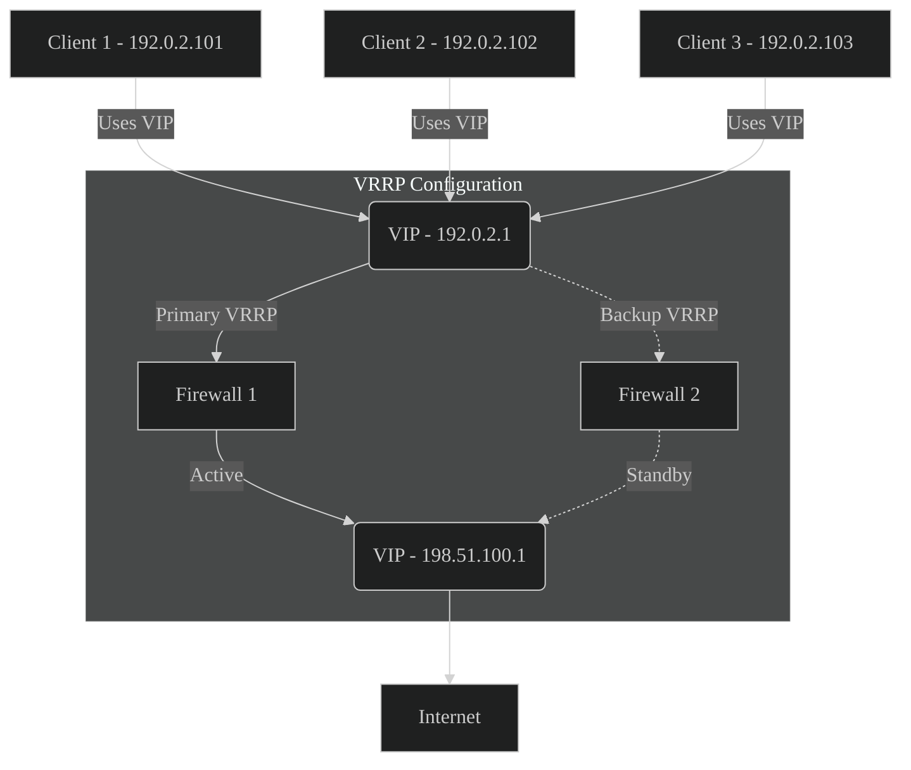

OPNsense added support for CARP peering over unicast with the last update, released on July 25 '24, and i had to test it.
{ .p-first} <!--more-->

## What is CARP

CARP is the OpenBSD implementation of VRRP or HSRP by CISCO.
CARP stands for **C**ommon **A**ddress **R**edundancy **P**rotocol.
HSRP is Cisco's proprietary solution **H**ot **S**tandby **R**outer **P**rotocol.
VRRP on the other hand stands for **V**irtual **R**outer **R**edundancy **P**rotocol.

Due to patent and licensing issues CARP was created as alternative to VRRP and serves the same porpuse.

In a network a IP address needs to be unique. How can you make an highly available IP that floats between multible devices?
For availability there are two devices and if one fails or needs to be rebooted to apply updates - how can you handle this without reconfiguration or any client noticing this downtime?

**To simplify:**
{ .inline }


Most commonly used is this for gateways or routers but not limited to those.


On Firewalls there are, most of the time, at least two floating IPs nessesarry.
One is the source gateway, the other is facing towards the destination.

When a clients wants to connect to some remote server the gateway is used to reach this server.
The source uses `192.0.2.1` as gateway, which is currently on _Firewall 1_.
From the remote site the gateway to the client is `198.51.100.1`.

When the _Firewall 1_ goes offline mid-communication both gateway IPs float to the _Firewall 2_.
And when those connection states are synced between both firewalls the connection will not be interrupted and nobody will notice.

## What is unicast

Unicast is one of three _cast_ methods for network communication.
**Broadcast/Anycast**
: is the typical way to communicate to all devices within the same IPv4 subnet - the broadcast domain.
  This works by _talking_ to the broadcast address - the highest address within a subnet.
  In a `192.0.2.0/24` network this is the IP `192.0.2.255`.
  IPv6 does have an other implemetnation to achive this, which is called **anycast** and works a bit diffferent.
  Clients subscribe and send to a multicast group. This is accomplished by assigning the same IPv6 address to more than one device.
  **Every device will** recive this package.
{ .d-loose }

**Multicast**
: is a way to communicate with other network members via a specific service address in the `224.0.0.0/4` range or `ff00::/8` for IPv6.
  Those are differently handled then traditional IP addresses.
  Addresses in `224.0.0.0/24` and `ffx2::/16` are uses for multicast within a local subnet.
  Some of those special addersses are not routable (cannot communicate across different subnets), others are.
  For VRRP, the underlying standart for CARP, this address is `224.0.0.18` and in IPv6 networks `ff02::12` which are not routable.
  NTP (`224.0.1.1`/`ff0x::101`) and PTP (`224.0.1.129–132`/`ff0x::181`/`ff02::6b`) on the other hand are routable across different networks.
  **Every device can** listen to those multicast messages.
{ .inline }


NTP = Network Time Protocol
PTP = Precision Time Protocol


**Unicast**
: is generally used to directly talk to one target specificly. This is how most of network traffic is transmitted.
  **One device** talks to only one reciepient.
{ .d-loose }

## Why is it such a big deal
